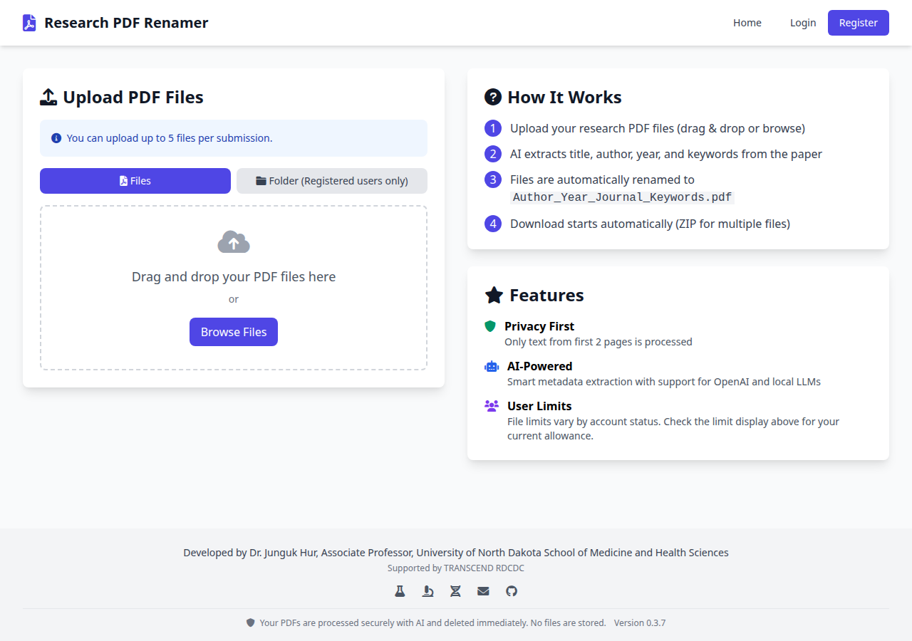
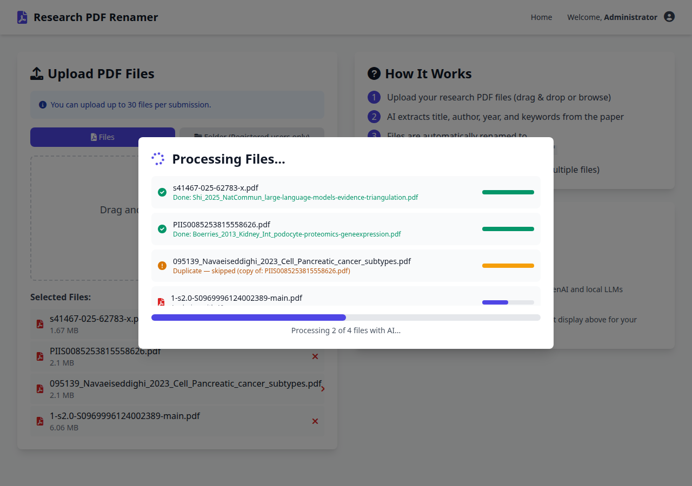
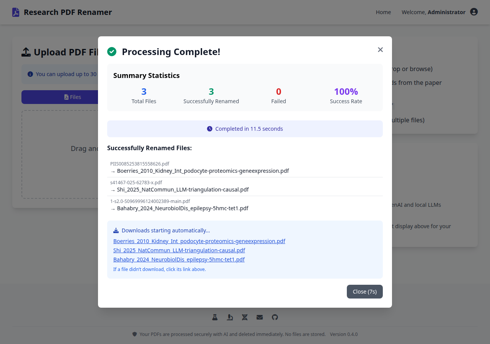
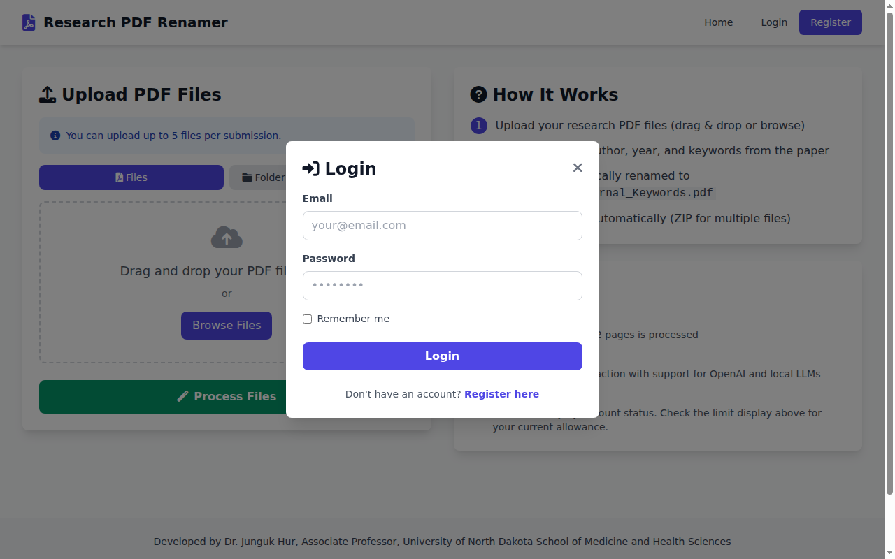
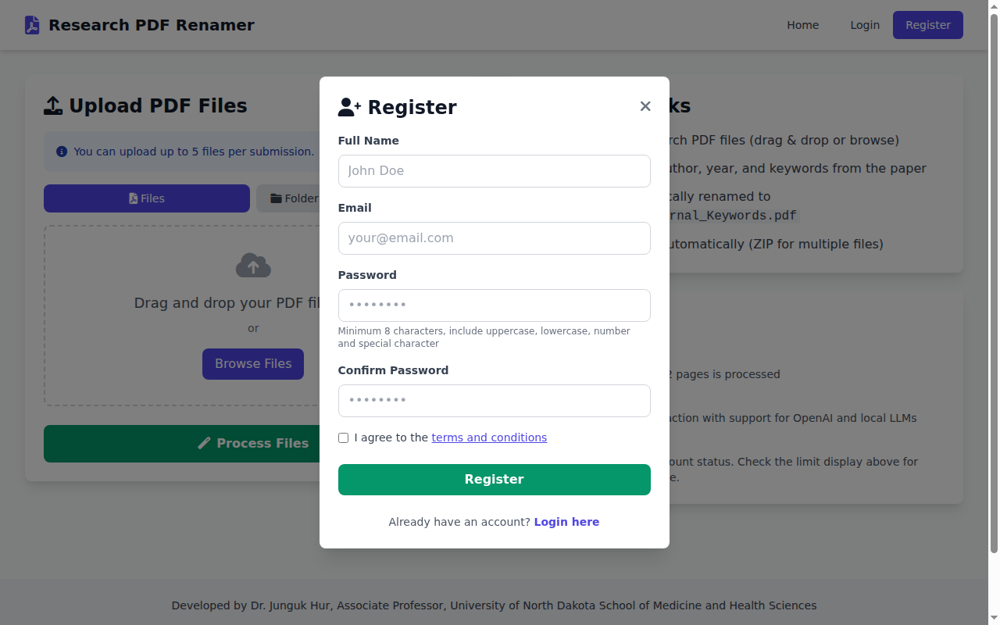
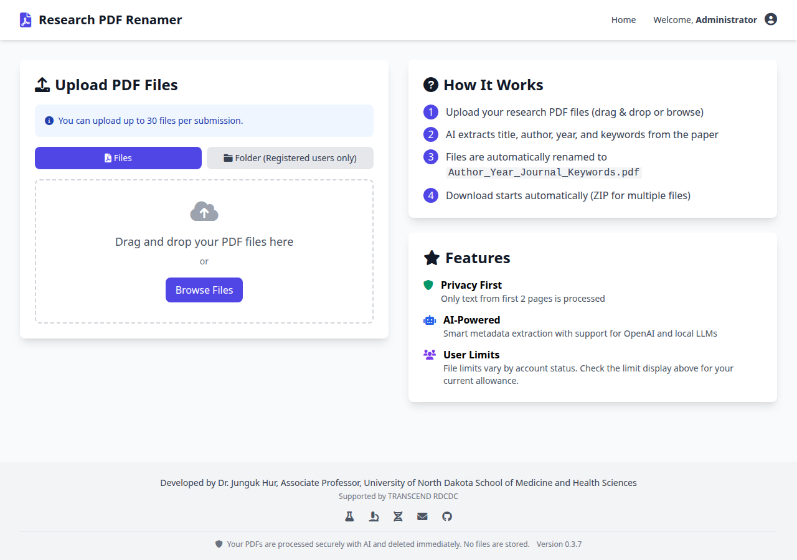
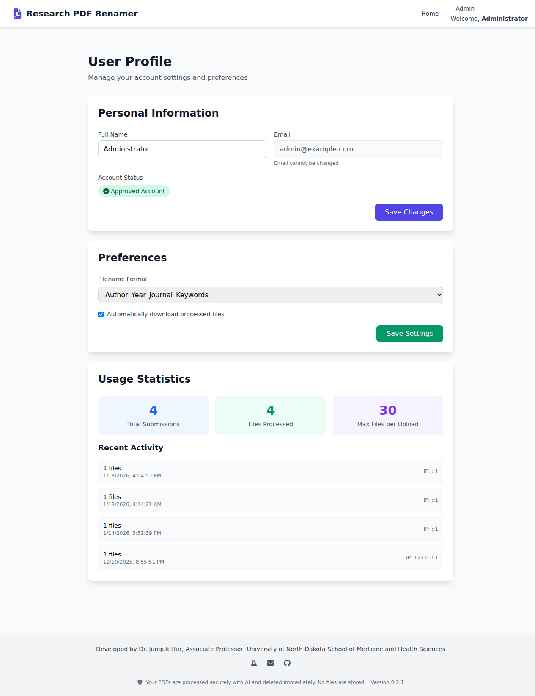
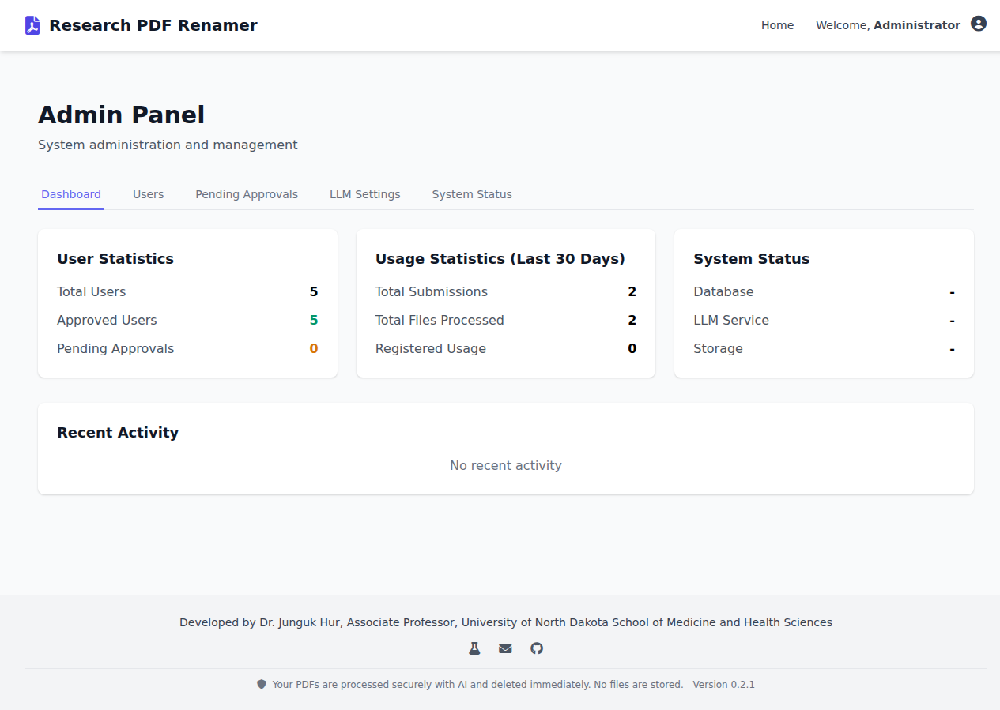
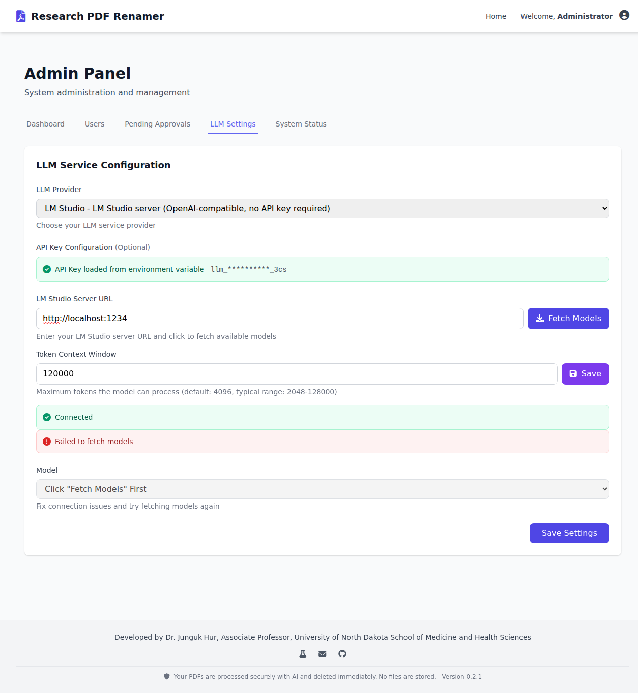

# Research PDF File Renamer

Managing large collections of research papers often means dealing with unhelpful filenames like `document.pdf`, `1-s2.0-S0123456789.pdf`, or `manuscript_final_v3.pdf`. Manually renaming each file by looking up author names, publication years, and journal titles is tedious and error-prone, especially when working with dozens or hundreds of papers across multiple research projects.

Research PDF File Renamer solves this problem by using large language models (LLMs) to automatically extract bibliographic metadata from your PDF files. Simply upload your papers through the drag-and-drop web interface, and the system reads the first one to two pages of each document, sends the extracted text to an AI model of your choice, and parses the response to identify the first author, publication year, journal name, and relevant keywords. The files are then renamed into a clean, standardized format such as `Author_Year_Journal_Keywords.pdf` and returned for download -- as individual files or as a ZIP archive for batch uploads.

The application supports multiple LLM providers including OpenAI, LM Studio, Ollama, and any OpenAI-compatible API server, making it suitable for both cloud-based and fully local, privacy-conscious deployments. It includes a complete user management system with registration, admin approval workflows, role-based access controls, and per-user upload limits. An admin dashboard provides system monitoring, LLM configuration, and user management capabilities. Deployment options range from a single Docker command to a production-grade systemd + Apache reverse proxy setup with SSL/TLS support.



## Features

- **Drag & Drop Upload** -- Modern interface with drag-and-drop and batch processing (up to 30 files)
- **AI-Powered Extraction** -- Uses LLM to extract author, year, title, journal, and keywords
- **Multi-Provider LLM Support** -- OpenAI, Ollama, LM Studio, or any OpenAI-compatible server
- **Privacy-First** -- Only text from first 1-2 pages is sent to AI; files are deleted after download
- **User Management** -- Registration with admin approval, role-based access, usage tracking
- **Admin Dashboard** -- User management, LLM configuration, system monitoring
- **Flexible Deployment** -- Docker, systemd + Apache reverse proxy, or standalone Flask

## Important: LLM Performance Note

> **This application works out of the box with a bundled CPU-based Ollama LLM, but CPU inference is slow** -- expect 1--3 minutes per file on a typical server.
>
> For practical use, it is **strongly recommended** to run this on a machine with a GPU and configure one of the following:
>
> - **Local GPU (Ollama):** Install [Ollama](https://ollama.com) on a GPU-enabled host, pull a model (e.g. `llama3.2`), and point the app at it via `OLLAMA_URL`.
> - **Local GPU (LM Studio):** Run [LM Studio](https://lmstudio.ai) on a GPU machine and configure the app as `LLM_PROVIDER=openai-compatible`.
> - **Cloud LLM API:** Use `LLM_PROVIDER=openai` with an `OPENAI_API_KEY` for fast, scalable inference without local hardware.
>
> Without a GPU or cloud API, the system is functional but not suitable for processing more than a handful of files at a time.

## Quick Start

### Option 1: Pre-built Docker Image (Fastest)

Pull the pre-built image from GitHub Container Registry. No cloning, no building required.

```bash
docker pull ghcr.io/ctr-transcend/research-pdf-renamer
```

**With OpenAI:**

```bash
docker run -d -p 5000:5000 \
  -e LLM_PROVIDER=openai \
  -e OPENAI_API_KEY=sk-your-key-here \
  -e ADMIN_CREATE=true \
  -e ADMIN_EMAIL=admin@local \
  -e ADMIN_PASSWORD=changeme123 \
  -v pdf-data:/app/instance \
  -v pdf-uploads:/app/uploads \
  ghcr.io/ctr-transcend/research-pdf-renamer
```

**With local Ollama (already running on your machine):**

```bash
docker run -d -p 5000:5000 \
  -e LLM_PROVIDER=ollama \
  -e OLLAMA_URL=http://host.docker.internal:11434 \
  -e ALLOW_PRIVATE_IPS=true \
  -e ADMIN_CREATE=true \
  -e ADMIN_EMAIL=admin@local \
  -e ADMIN_PASSWORD=changeme123 \
  -v pdf-data:/app/instance \
  -v pdf-uploads:/app/uploads \
  ghcr.io/ctr-transcend/research-pdf-renamer
```

Open http://localhost:5000 and log in with the admin credentials above.

### Option 2: Docker Compose -- Zero Config with Built-in LLM

Includes a built-in Ollama LLM server that auto-downloads a model (~2 GB) on first start. No API key or external LLM needed.

```bash
git clone https://github.com/CTR-TRANSCEND/research-pdf-renamer.git
cd research-pdf-renamer
docker compose up -d
```

The first startup takes a few minutes while the AI model downloads. All settings can be customized via a `.env` file without editing `docker-compose.yml`:

```bash
# .env (optional -- all values have defaults)
LLM_MODEL=llama3.2:1b          # Use smaller model for low-resource machines
ADMIN_PASSWORD=mysecurepass     # Override default password
OLLAMA_URL=http://ollama:11434  # Default, points to bundled Ollama
```

### Option 3: Local Installation

Works with any Python 3.10+ environment (conda, venv, or system Python). The setup script auto-creates a virtual environment if needed.

```bash
git clone https://github.com/CTR-TRANSCEND/research-pdf-renamer.git
cd research-pdf-renamer
./setup.sh
./start.sh
```

On first startup with no existing users, the app auto-creates an admin account and writes the generated password to `instance/.admin_initial_password` (readable only by the file owner). Read that file once to get the password, then log in and change it.

Access the application at http://localhost:5000

### Default Admin Account

| | |
|---|---|
| **Email** | `admin@local` |
| **Password** | `changeme123` |

> **Important:** Change the default credentials after first login. For local installations (Option 3), credentials are auto-generated and printed to the console on first startup.

---

## User Guide

### Uploading PDFs

The main page provides a drag-and-drop area for uploading PDF files. You can also click **Browse Files** to select files from your computer.

1. Drag your PDF files onto the upload area (or click Browse)
2. Click **Process Files** to start AI extraction
3. The system extracts metadata from the first 1-2 pages
4. Files are automatically renamed to `Author_Year_Journal_Keywords.pdf`
5. Download starts automatically (ZIP for multiple files)



When complete, a summary popup shows every original filename mapped to its new name, with per-file download links.



**Upload limits:**
- Anonymous users: 5 files per submission, 5 submissions per year
- Registered users: 30 files per submission, unlimited submissions

### Registration and Login

Click **Register** in the top navigation to create an account. Registration requires admin approval before you can log in.

| Login | Registration |
|:---:|:---:|
|  |  |

After logging in, the upload limit increases and you gain access to folder upload and your profile page.



### User Profile

Access your profile from the navigation bar to:

- Update your display name
- Choose a filename format (e.g., `Author_Year_Journal_Keywords`, `Author_Year_Title`, or custom)
- Toggle automatic downloads
- View your usage statistics and recent activity



### Admin Panel

Administrators have access to the admin panel at `/admin` with the following tabs:

**Dashboard** -- Overview of user statistics, usage metrics, and system status.



**Users** -- Manage all registered users. Approve, deactivate, promote to admin, or delete accounts. Adjust per-user file limits.

**Pending Approvals** -- Review and approve new user registrations.

**LLM Settings** -- Configure the AI provider. Select from LM Studio, Ollama, OpenAI, or any OpenAI-compatible server. Fetch available models, set context window size, and test connectivity.



**System Status** -- Monitor database health, LLM service status, and storage.

---

## Configuration

### Environment Variables

Copy `.env.example` to `.env` and configure:

| Variable | Description | Default |
|----------|-------------|---------|
| `SECRET_KEY` | Flask secret key for sessions | Auto-generated |
| `LLM_PROVIDER` | LLM provider (`openai`, `ollama`, `lm-studio`, `openai-compatible`) | `openai` |
| `LLM_MODEL` | Model name | `gpt-4o-mini` |
| `OPENAI_API_KEY` | OpenAI API key | Required for OpenAI provider |
| `OLLAMA_URL` | Ollama/LM Studio server URL | `http://localhost:11434` |
| `ALLOW_PRIVATE_IPS` | Allow private IPs for LLM server URLs | `false` |
| `RATE_LIMIT_STORAGE_URL` | Redis URL for persistent rate limiting | `memory://` |
| `INACTIVITY_TIMEOUT_MINUTES` | Session inactivity timeout | `30` |
| `TALISMAN_FORCE_HTTPS` | Force HTTPS redirects | `true` (set `false` for Docker) |
| `APPLICATION_ROOT` | Sub-path for reverse proxy (e.g., `/pdf-renamer`) | (none) |

### LLM Provider Setup

#### OpenAI

```bash
LLM_PROVIDER=openai
LLM_MODEL=gpt-4o-mini
OPENAI_API_KEY=sk-...
```

#### LM Studio

```bash
LLM_PROVIDER=lm-studio
LLM_MODEL=your-model-name
OLLAMA_URL=http://localhost:1234
```

Context window is auto-detected from the LM Studio API. No API key required.

#### Ollama

```bash
LLM_PROVIDER=ollama
LLM_MODEL=llama3.2
OLLAMA_URL=http://localhost:11434
```

#### OpenAI-Compatible Server

```bash
LLM_PROVIDER=openai-compatible
LLM_MODEL=your-model-name
OPENAI_COMPATIBLE_API_KEY=your-api-key
OLLAMA_URL=http://localhost:8000
```

> **Note:** If your LLM server runs on a private network, set `ALLOW_PRIVATE_IPS=true` in your `.env` file.

---

## Production Deployment

### Upgrading to v0.3.5

v0.3.5 introduces a non-root container user (`app`, UID 1000). Existing v0.3.4 deployments ran as root, so the Docker named volumes (`pdf-data`, `pdf-uploads`, `pdf-temp`) contain root-owned files that the new `app` user cannot write to without a one-time ownership fix.

**No manual migration is required.** The new entrypoint script (`docker/entrypoint.sh`) handles this automatically:

1. The container starts briefly as root.
2. The entrypoint `chown`s the three writable volumes to `app:app`.
3. `gosu` drops privileges and hands off to gunicorn, which runs as UID 1000 for the lifetime of the container.

For fresh deployments the `chown` is a no-op -- volumes are initialized with correct ownership at image build time.

**Verify after upgrade:**

```bash
docker compose top pdf-renamer
# The gunicorn process(es) should show UID 1000 in the USER column.
```

### Docker

```bash
cp .env.example .env
# Edit .env with production settings (SECRET_KEY, LLM config)
docker compose up -d
```

### Pre-built Image

```bash
docker pull ghcr.io/ctr-transcend/research-pdf-renamer:latest
docker run -d -p 5000:5000 \
  -e LLM_PROVIDER=openai -e OPENAI_API_KEY=sk-... \
  -e ADMIN_CREATE=true -e ADMIN_EMAIL=admin@local -e ADMIN_PASSWORD=changeme123 \
  -v pdf-data:/app/instance -v pdf-uploads:/app/uploads \
  ghcr.io/ctr-transcend/research-pdf-renamer
```

### Systemd + Apache

```bash
sudo systemd/install.sh
```

This creates a systemd service with Gunicorn (3 workers) and configures log rotation. See the [Deployment Guide](docs/deployment.md) for Apache reverse proxy and SSL/TLS setup with Let's Encrypt.

### Security Checklist

- [x] XSS protection (Jinja2 auto-escaping + `escapeHtml()`)
- [x] CSRF protection for state-changing endpoints
- [x] SQL injection prevention (SQLAlchemy ORM)
- [x] Password hashing (bcrypt)
- [x] Rate limiting (Flask-Limiter, optional Redis backend)
- [x] SSRF protection for LLM server URLs
- [x] File type validation (magic bytes)
- [ ] HTTPS in production (`certbot --apache -d your-domain.com`)
- [ ] Strong `SECRET_KEY` (`python3 -c 'import secrets; print(secrets.token_hex(32))'`)

---

## Development

### Running Tests

```bash
# Unit and integration tests (256 tests)
pytest tests/ -v -m "not e2e"

# E2E workflow tests (15 tests)
pytest tests/e2e/ -v

# All tests (271 total)
pytest tests/ -v

# With coverage
pytest --cov=backend tests/
```

### Project Structure

```
research-pdf-renamer/
├── backend/
│   ├── app.py                  # Flask application factory
│   ├── models/                 # SQLAlchemy models (user, usage, settings)
│   ├── routes/                 # API endpoints (auth, upload, admin, main)
│   ├── services/               # Business logic (PDF processing, LLM, files)
│   └── utils/                  # Auth, validators, metrics, logging
├── frontend/
│   ├── static/js/main.js       # Frontend logic
│   └── templates/              # Jinja2 templates (index, admin, profile)
├── tests/                      # 271 tests (unit, integration, E2E)
├── docs/                       # Deployment guide, screenshots
├── systemd/                    # Systemd service and install script
├── Dockerfile                  # Docker container definition
├── docker-compose.yml          # Docker Compose configuration
├── run.py                      # Entry point
├── setup.sh                    # Local setup script
└── requirements.txt            # Python dependencies
```

## Publishing Docker Images (Maintainers)

The pre-built Docker image is hosted on GitHub Container Registry (GHCR). To publish a new version:

**One-time setup:**

1. Create a GitHub Personal Access Token at https://github.com/settings/tokens
   - Select scope: `write:packages`
2. Log in to GHCR:
   ```bash
   echo "YOUR_PAT" | docker login ghcr.io -u YOUR_GITHUB_USERNAME --password-stdin
   ```

**Publishing a new version:**

```bash
# Build with the latest code
docker build -t ghcr.io/ctr-transcend/research-pdf-renamer:latest \
             -t ghcr.io/ctr-transcend/research-pdf-renamer:0.3.0 .

# Push both tags
docker push ghcr.io/ctr-transcend/research-pdf-renamer:latest
docker push ghcr.io/ctr-transcend/research-pdf-renamer:0.3.0
```

A GitHub Actions workflow (`.github/workflows/docker-publish.yml`) can also auto-publish when you push a version tag:

```bash
git tag v0.3.0
git push origin v0.3.0
```

> **Note:** `docker login` credentials are stored in `~/.docker/config.json`. If the file doesn't show `ghcr.io`, you need to re-login before pushing.

---

## API Reference

| Method | Endpoint | Description |
|--------|----------|-------------|
| `GET` | `/` | Main application page |
| `GET` | `/api/health` | Health check with uptime and dependencies |
| `GET` | `/api/metrics` | Application metrics (admin) |
| `POST` | `/api/auth/register` | User registration |
| `POST` | `/api/auth/login` | User login |
| `POST` | `/api/auth/logout` | User logout |
| `POST` | `/api/upload` | Upload and process PDFs |
| `GET` | `/api/download/<filename>` | Download processed file |
| `GET` | `/api/admin/users` | List all users (admin) |
| `POST` | `/api/admin/approve/<id>` | Approve user (admin) |
| `GET/POST` | `/api/admin/llm-settings` | LLM configuration (admin) |
| `GET` | `/api/admin/system-status` | System health (admin) |

## Acknowledgments

This work is supported by:

- **[TRANSCEND RDCDC](https://med.und.edu/research/transcend/index.html)** — supported by the National Institute of General Medical Sciences of the National Institutes of Health under Award Number **P20GM155890**
- **Host-Pathogen Interactions COBRE** — supported by the National Institute of General Medical Sciences of the National Institutes of Health under Award Number **P20GM113123**

The content is solely the responsibility of the authors and does not necessarily represent the official views of the National Institutes of Health.

## License

MIT License. See [LICENSE](LICENSE) for details.

---

Developed by [Dr. Junguk Hur](https://med.und.edu/research/labs/hur/index.html), Associate Professor, University of North Dakota School of Medicine and Health Sciences

*Last updated: April 30, 2026*
